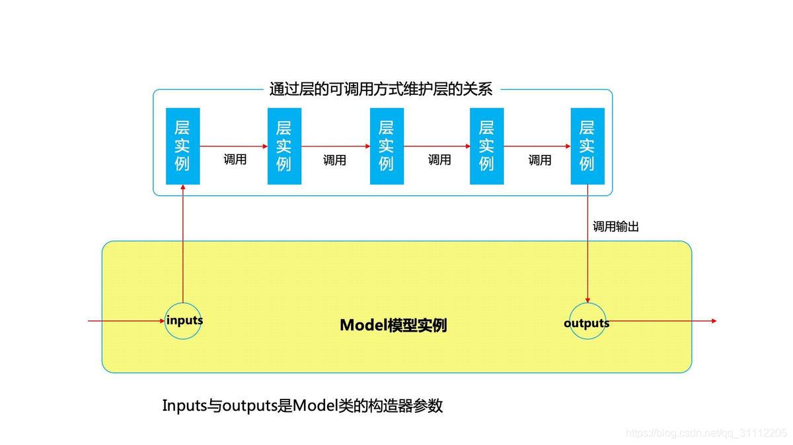

# 编程技巧
## 一、库引入写法
1. `import`：直接引入对应的包
2. `from A import B`：从A中引入B，相当于
   ```py
   import A
   b=A.b
   ```
3. `import A as B`：给引入的包A定义一个别名B
## 二、常用库
```py
import numpy as np
import matplotlib.pyplot as plt
import h5py
import scipy
from PIL import Image
from scipy import ndimage
import sklearn
import sklearn.datasets
import sklearn.linear_model
import argparse
import tensorflow as tf
```
1. numpy：科学计算库
2. matplotlib：2D绘图库
   - matplotlib.pyplot：绘图模块
3. h5py：python中一种数据压缩格式，常用于在深度学习时处理大量图像
   - h5py文件由数据集(dataset)和组(group)两部分组成
4. scipy：基于numpy构建的高级科学计算库
5. PIL：图像处理库
6. sklearn: 机器学习库
7. tensorflow: 开源深度学习框架
8. Keras：Keras是一个由Python编写的开源人工神经网络库，可以作为Tensorflow、Microsoft-CNTK和Theano的高阶应用程序接口，进行深度学习模型的设计、调试、评估、应用和可视化。
9. Argparse: Python 内置的用于命令项选项与参数解析的模块

### Numpy
1. `np.squeeze(a, axis=None)`
   - 作用：从数组中删除单维度条目，即把shape=1的维度去掉，但对非单维度的维度不起作用
2. `X, Y = np.meshgrid(x, y)`
   - 作用：将x中每一个数据和y中每一个数据组合生成很多点,然后将这些点的x坐标放入到X中,y坐标放入Y中,并且相应位置是对应的
3. 当你想将维度为（a，b，c，d）的矩阵X展平为形状为(bcd, a)的矩阵X_flatten时的一个技巧是：
   ```py
   # -1是指未设定行数/列数
   # ✔
   X_flatten = X.reshape(X.shape[0]，-1).T
   # ❌
   X_flatten = X.reshape(-1, X.shape[0])
   ```
4. `np.arange(start = 0, stop, step = 1)`
   - 作用：返回一个有终点和起点的固定步长的排列
   - 基本参数：
     1. start: 起点
     2. stop: 终点
     3. step: 步长
5. `np.c_()`
   - 作用：列叠加两个矩阵（是把两个矩阵左右组合，要求行数相等）
6. `np.ravel()`
   - 作用：将多维数组降为一维，返回视图（修改时会影响原始矩阵）
7. `np.flatten()`
   - 作用：将多维数组降为一维，返回拷贝（修改时不会影响原始矩阵）
8. `np.randpm.rand`
   - 作用：返回一个或一组服从**0~1均匀分布**的随机样本值
9. `np.random.randn`
   - 作用：从**标准正态分布**中返回一个或多个样本值
10. numpy数组切片：`X[:, 1:3]`
    - 作用：行全取，列取1、2列
11. `np.pad(array，pad_width，mode，**kwargs)`
    - 作用：在numpy数组的边缘进行数值填充(padding), 并返回填充后的numpy数组
    - 基本参数：
      1. array：要填充的numpy数组
      2. pad_width：每个轴要填充的数据的数目
      3. mode：填充的方式（'constant': 连续填充相同数字）
### Matplotlib
1. `plt.scatter()`
   - 作用：生成散点图
   - 基本参数：
     1. x, y: 散点的坐标
     2. s: 散点的面积
     3. c: 散点的颜色（默认值为蓝色，'b'，其余颜色同plt.plot( )）
     4. marker: 散点样式（默认值为实心圆，'o'，其余样式同plt.plot( )）
     5. alpha: 散点透明度（[0, 1]之间的数，0表示完全透明，1则表示完全不透明）
     6. linewidths: 散点的边缘线宽
     7. edgecolors: 散点的边缘颜色
     8. cmap: 颜色映射(仅仅当c是一个浮点数数组的时候才使用)
2. `plt.contourf(xx,yy,z,cmap)`
   - 作用：画出不同分类的边界线
   - 基本参数：
     1. X, Y: 坐标位置
     2. z: 坐标对应的值（坐标高度值），用于画出边界线（等高线）
3. `%matplotlib inline`
   - 作用: 将matplotlib的图表直接嵌入到Notebook之中，使用该魔法函数后可以省略`plt.show()`
4. `plt.rcParams[...]`
   - 作用：rc字典，可以自定义matplotlib中的各种属性
   - 例：
     ```py
     plt.rcParams['savefig.dpi'] = 300 #图片像素
     plt.rcParams['figure.dpi'] = 300 #分辨率
     plt.rcParams['figure.figsize'] = (10, 10)        # 图像显示大小
     plt.rcParams['image.interpolation'] = 'nearest'  # 最近邻差值: 像素为正方形
     plt.rcParams['image.cmap'] = 'gray'  # 使用灰度输出而不是彩色输出
     ```
5. `ax = plt.gca()`
   - 作用：坐标轴移动
### Tensorflow
> 请记住，实现tensorflow模型包含两个部分:
> - 创建计算图
> - 运行计算图
1. `tf.constant(value, dtype, shape, name)`
   - 作用：创建常量
2. `tf.Variable(initial_value, dtype, shape, name)`
   - 作用：创建变量
3. `tf.get_variable(name, shape=None, dtype=None,  initializer=None)`
   - 作用：创建变量
   > tf.get_variable()和tf.Variable()的区别:
   > - 使用tf.Variable时，如果检测到命名冲突，系统会自己处理。使用tf.get_variable()时，系统不会处理冲突，而会报错。
   > - tf.Variable()每次都在创建新的对象，与name没有关系。而tf.get_variable()对于已经创建的同样name的变量对象，就直接把那个变量对象返回（类似于：共享变量），tf.get_variable() 会检查当前命名空间下是否存在同样name的变量，可以方便共享变量
   > - tf.get_variable()：对于在上下文管理器中已经生成一个v的变量，若想通过tf.get_variable函数获取其变量，则可以通过reuse参数的设定为True来获取
4. `init = tf.global_variables_initializer() `
   - 作用：添加节点用于初始化所有的变量。返回一个初始化所有全局变量的操作（Op）。在你构建完整个模型并在会话中加载模型后，运行这个节点
5. ```py
   with tf.Session() as session:
       session.run(init)
       print(session.run(w))
   ```
   - 作用：创建一个TensorFlow会话，初始化并评估变量w
   > 如果不创建会话，所有操作只是放入“计算图”中，但你尚未运行此计算，**必须创建一个会话并在该会话中运行操作**
6. `tf.placeholder(type, shape, name)`
   - 作用：placeholders(占位符)。占位符是一个对象，你只能在运行会话时才将数据分配给该变量

     要为占位符指定值，你可以使用"feed dictionary"（feed_dict变量）传入值
     ```py
     x = tf.placeholder(tf.int64, name = 'x')
     print(sess.run(2 * x, feed_dict = {x: 3}))
     ```
7. `tf.matmul(A, B)`
   - 作用：矩阵乘法
8. $L(\hat y,y )$方程函数：
   1. `tf.nn.sigmoid_cross_entropy_with_logits(logits = z, labels = y)`
      > logits就是神经网络模型中的$Z=WX+b$矩阵，注意不需要经过sigmoid
      - 作用：实现sigmoid交叉熵损失
      $$ L(\hat y,y ) = \small y^{(i)} \log \sigma(z^{[2](i)}) + (1-y^{(i)})\log (1-\sigma(z^{[2](i)})$$
   2. `tf.nn.softmax_cross_entropy_with_logits(logits = z, labels = y)`
      > logits是神经网络最后一层的输出，未经过soft_max
      - 作用：实现softmax交叉熵损失
      $$\hat y = g{(z)} = \frac{e^{(z)}}{\sum_{j=1}^{C}e^{(z)}_j}$$
      $$ L(\hat y,y ) = - \sum_{j = 1}^{C}{y_{j}log\hat y_{j}}$$
9.  `tf.one_hot(labels, depth, axis)`
   - 作用：独热编码，因为在转换后的表示形式中，每一列中的一个元素正好是“hot”（设为1）
   - 参数：
     1. labels：转换前的y向量，数字范围从0到depth-1
     2. depth：转换后矩阵的深度(类别数量)
     3. axis：进行独热编码的维数，默认对最后一维进行独热编码
   - 例子：
     
     
     ```py
     labels = np.array([1,2,3,0,2,1])
     C = 4
     one_hot_matrix = tf.one_hot(labels, C, axis=0) 
     ```
   - 当我们想不用Tensorflow库函数来生成独热编码时，我们也可以这样写:
     ```py
     def covert_to_one_hot(Y,C):
         Y=np.eye(C)[Y.reshape(-1)].T
         return Y
     ```
10. Tensorflow中的初始化函数：
    > 作为tf.get_variable()的参数
    1. `tf.contrib.layers.xavier_initializer(seed = 1)`
       - 作用：返回初始化权重矩阵
    2. `tf.zeros_initializer()`
       - 作用：生成张量初始化为 0 的初始化器
11. Tensorflow中的激活函数：
    1. `tf.sigmoid(z)`
    2. `tf.nn.relu(z)`
12. `tf.reduce_mean(input_tensor, axis=None)`
    - 作用：用于计算tensor(张量)沿着指定的数轴(即tensor的某一维度)上的平均值
    - 参数：
      1. input_tensor：输入待降维的tensor
      2. axis：指定的轴，默认为计算所有元素的均值
13. `tf.transpose(a)`
    - 作用：矩阵转置
14. Tensorflow优化器：
    1. 梯度下降优化器：
    ```py
    optimizer = tf.train.GradientDescentOptimizer(learning_rate = learning_rate).minimize(cost)
    ```
    2. Adam优化器：
    ```py
    optimizer = tf.train.AdamOptimizer(learning_rate = learning_rate).minimize(cost)
    ```
    3. 执行优化：
    ```py
    _ , minibatch_cost = sess.run([optimizer, cost], feed_dict={X: minibatch_X, Y: minibatch_Y})  
    ```
15. `tf.reset_default_graph()`
    - 作用：清除默认图形堆栈并重置全局默认图形
16. `tf.nn.conv2d(X,W1, strides = [1,s,s,1], padding = 'SAME')`
    - 作用：给定输入和一组滤波器，函数将使用的滤波器卷积X。
17. `f.nn.max_pool(A, ksize = [1,f,f,1], strides = [1,s,s,1], padding = 'SAME')`
    - 作用：给定输入A，此函数使用大小为（f，f）的窗口和大小为（s，s）的步幅在每个窗口上进行最大池化。
18. `tf.contrib.layers.flatten(P)`
    - 作用：给定输入P，此函数将每个示例展平为一维向量，同时保持批量大小。它返回维度为[batch_size，k]的展平张量。
19. `tf.contrib.layers.fully_connected(F, num_outputs, activation_fn = None)`
    - 作用：给定展平的输入F，它将返回用全连接层计算出的输出。
    > 全连接层会自动初始化图中的权重，并在训练模型时继续对其进行训练。因此，初始化参数时无需初始化这些权重。

### Keras
```py
from keras import layers
from keras.layers import Input, Add, Dense, Activation, ZeroPadding2D, BatchNormalization, Flatten, Conv2D, AveragePooling2D, MaxPooling2D, GlobalMaxPooling2D
from keras.models import Model, load_model
from keras.preprocessing import image
from keras.utils import layer_utils
from keras.utils.data_utils import get_file
from keras.applications.imagenet_utils import preprocess_input
import pydot
from IPython.display import SVG
from keras.utils.vis_utils import model_to_dot
from keras.utils import plot_model
from resnets_utils import *
from keras.initializers import glorot_uniform
```
> Keras使用变量名与我们之前使用numpy和TensorFlow不同。不是在正向传播的每个步骤上创建和分配新变量，例如X, Z1, A1, Z2, A2等，以用于不同层的计算， Keras代码上面的每一行只是使用X = ...将X重新分配给新值。

为了训练和测试该模型，Keras中有四个步骤：
- 通过调用相关函数创建模型
- 通过调用`model.compile(optimizer = "...", loss = "...", metrics = ["accuracy"])`编译模型
  - optimizer：优化器，用于控制梯度裁剪。必选项
  - loss：损失函数（或称目标函数、优化评分函数）。必选项
  - metrics：评价函数用于评估当前训练模型的性能。当模型编译后（compile），评价函数应该作为 metrics 的参数来输入。
- 通过调用`model.fit(x = ..., y = ..., epochs = ..., batch_size = ...)`训练模型
  - x: 输入值
  - y：输出标签$\hat{y}$
  - epochs: 迭代次数
  - batch_size: 每次梯度更新的样本数即批量大小
- 通过调用`model.evaluate(x = ..., y = ...)`测试模型

1. `keras.layers`:keras中layer对象的基类
   1. `X_input = Input(shape=None,batch_size=None)`
      - 作用：返回神经网络输入
   2. `X = ZeroPadding2D(padding=(1, 1))(X_input)`
      - 作用：2D输入的零填充层。
   3. `X = Conv2D(8, kernel_size=(3,3), strides=(1,1))(X)`
      - 作用：2D卷积
   4. `X = BatchNormalization(axis=3)(X)`
      - 作用：归一化，使数据的均值接近于0,标准差接近1
   5. `X = Activation('relu')(X)`
      - 作用：激活函数
   6. `X = MaxPooling2D(pool_size=(2,2), strides=(2,2), padding='valid')(X)`
      - 作用：Max池化层
   7. `X = Flatten()(X)`
      - 作用：将输入层的数据压成一维的数据，用于Connected layer
   8. `Y = Dense(1, activation='sigmoid')(X)`
      - 作用：全连接层(第一个参数是**输出空间的维数**)
   9. `X = layers.add([X, X_shortcut])`
      - 作用：将X_shortcut值添加到主路径X(**残差网络时用**)
   10. `X = AveragePooling2D(pool_size=(2,2))(X)`
       - 作用：Average池化层
   11. ``
       - 作用：
2. `keras.models`:keras的模型接口（函数式模型）
   1. `model = Model(inputs = X_input, outputs = Y, name='HappyModel')`
      - 作用：Model只需要通过inputs与outputs(Layer对象)，通过这种调用建立层之间的网络模型。
    
      
3. 其他
   1. `myModel.summary()`
      - 作用：以表格形式打印每层输入输出的详细信息
   2. `plot_model(myModel, to_file='MyModel.png')`
      - 作用：绘制图形，如果你想在社交媒体上共享它，可以使用SVG（）将其另存为“ .png”(`SVG(model_to_dot(myModel).create(prog='dot', format='svg'))`)，它保存在笔记本计算机上方栏中的"File"然后"Open..." 中。


## 三、数据处理
1. 预处理数据集：
   - 找出数据的尺寸和维度（m_train，m_test，num_px等）
   - 重塑数据集，以使每个示例都是大小为（num_px \ num_px \ 3，1）的向量
   - “标准化”数据
2. 建立神经网络的一般方法：
   1. 定义神经网络结构（输入单元数，隐藏单元数等）。
   2. 初始化模型的参数
   3. 循环：
      - 实现前向传播（获得$\hat{y}$）
      - 计算损失
      - 后向传播以获得梯度
      - 更新参数（梯度下降）
